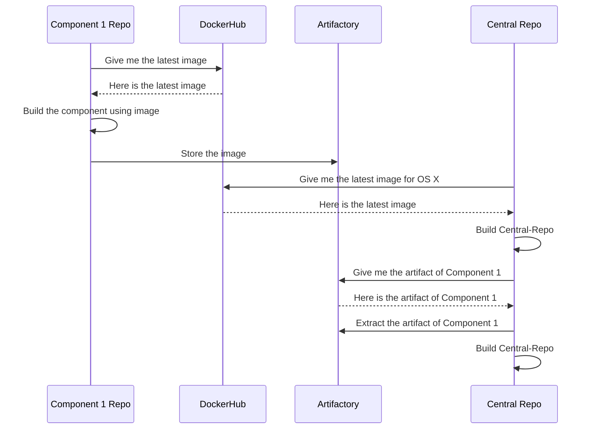

```mermaid
sequenceDiagram
    Component 1 Repo->>DockerHub: Give me the latest image
    DockerHub-->>Component 1 Repo: Here is the latest image
    Component 1 Repo->>Component 1 Repo: Build the component using image
    Component 1 Repo->>Artifactory: Store the image
    Central Repo->>DockerHub: Give me the latest image for OS X 
    DockerHub-->>Central Repo: Here is the latest image
    Central Repo->>Central Repo: Build Central-Repo  
    Central Repo->>Artifactory: Give me the artifact of Component 1
    Artifactory-->>Central Repo: Here is the artifact of Component 1
    Central Repo->>Artifactory: Extract the artifact of Component 1 
    Central Repo->>Central Repo: Build Central-Repo
```